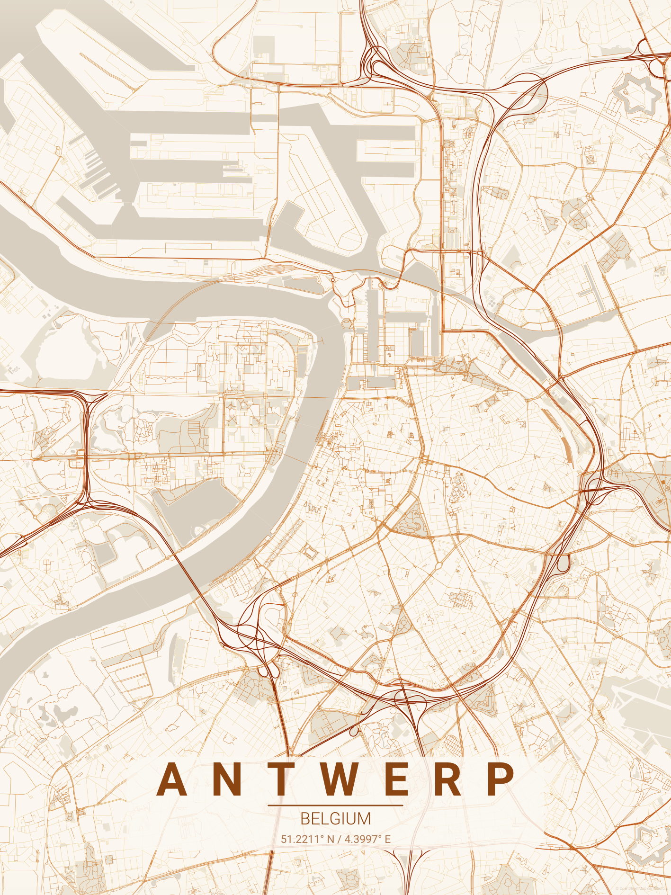

# City Map Poster Generator

Public, no-auth city poster generator built with a **Bun + Turborepo** monorepo:

- `apps/web`: Next.js (App Router) + Tailwind + `shadcn/ui`-style components + TanStack Query
- `apps/api`: Go API + Redis queue + MinIO/S3 artifact storage + pure-Go renderer
- `docker-compose.yml`: web, api, worker, redis, minio

## Preview



## Stack

- Frontend: Next.js 16, React 19, Tailwind, `react-hook-form`, `zod`, `framer-motion`
- Backend: Go (`chi`, `go-redis`, AWS SDK S3), Redis queue worker, MinIO/S3, Cloudflare Turnstile
- Rendering: OpenStreetMap vector fetch (Overpass + Nominatim), layered map poster renderer
- Tooling: Bun workspaces, Turborepo, Biome, TypeScript

## Node Runtime (nvm + latest LTS)

```bash
nvm install --lts
nvm use --lts
node -v
```

Expected version: `v24.14.0`.

## Quick Start

1. Install JS deps:

```bash
bun install
```

2. Copy environment template:

```bash
cp .env.example .env
```

3. Start full stack:

```bash
docker compose up --build
```

4. Open:

- Web: `http://localhost:3000`
- API: `http://localhost:8000`
- MinIO Console: `http://localhost:9001`

## Local Dev

Use Docker for backend infra/services and run frontend on host for HMR.
Go API and worker also run with container HMR (via `air`) in this mode:

```bash
bun run dev:backend
bun run dev:web
```

One-command variant:

```bash
bun run dev:local
```

Useful backend commands:

```bash
bun run dev:backend:logs
bun run dev:backend:down
```

Production-like backend (compiled binaries, no HMR):

```bash
docker compose up -d redis minio api worker
```

## Scripts

```bash
bun run dev           # docker backend + web HMR
bun run dev:web
bun run dev:api       # go API (requires local Go toolchain)
bun run dev:worker    # go worker (requires local Go toolchain)

bun run lint          # biome (web) + go vet (api)
bun run check-types   # tsc/next + go test
bun run format        # biome format
```

## API Endpoints

- `GET /health`
- `GET /v2/themes`
- `GET /v2/locations`
- `GET /v2/fonts`
- `POST /v2/preview`
- `POST /v2/jobs`
- `GET /v2/jobs/{jobId}`
- `GET /v2/jobs/{jobId}/download`

## Feature Coverage

- Required: city, country
- Optional: latitude/longitude overrides, distance, dimensions, font family
- Units and dimensions:
  - Default size: `30 x 40 cm`
  - Centimeters mode: `10 cm` min, `200 cm` max
  - Inches mode: `5 in` min, `80 in` max
- Distance range: `1000 m` to `18000 m`
- Themes: all bundled built-in themes
- Export formats: `png`, `svg`, `pdf`
- `allThemes`: generate every theme + ZIP output
- Preview caching + artifact storage with presigned downloads
- Live Preview renderer mode: `local-wasm` by default, automatic fallback to `server-fallback` when local rendering is unavailable or times out
- Google Fonts searchable picker for `fontFamily`
- Custom Google-font rendering for PNG/PDF when `GOOGLE_FONTS_API_KEY` is configured

## Theme Gallery Previews

Static theme gallery assets remain in:

- `apps/web/public/theme-previews/<theme-id>.svg`

## CAPTCHA and Rate Limiting

- Turnstile verification for generation endpoint (`/v2/jobs`) when `CAPTCHA_REQUIRED=true`
- IP rate limits (defaults):
  - Location search: `60 / 10 min`
  - Font search: `120 / 10 min`
  - Preview and render snapshot: `20 / 10 min`
  - Jobs and exports: `3 / 10 min`
  - Concurrent jobs: `2`
- Development-only bypass:
  - In non-production (`APP_ENV != production`), the header `Dev settings` toggle can reveal a full-width development card above map controls and live preview.
  - That card exposes toggles for disabling API rate limits and CAPTCHA checks for local testing.
  - Production ignores dev bypass headers.

## Notes

- Geocoding uses public Nominatim by default. For production throughput, use a dedicated provider.
- Generated artifacts are short-lived (24h retention target).
